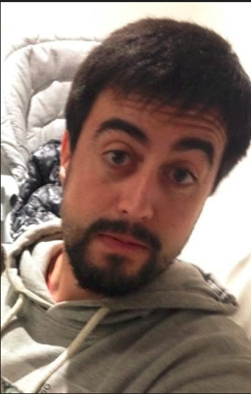

Bienvenidos a
# Programación con objetos I
## Mi nombre es Joaquin Villar y estoy cursando la materia POO.

El objetivo de este cuatrimestre es tratar de enterder como funciona este lenguaje orientado a Objetos.
:upside_down_face:

```
object saludo { 
    method saludarALosProfes() { 
        return  "Hola a todos" 
    }
}
```

## Datos del estudiante:
* Tengo 35 años
* Vivo en Hurlingham.
* Estoy cursando la carrera Licenciatura en Informatica en la UNAHUR.